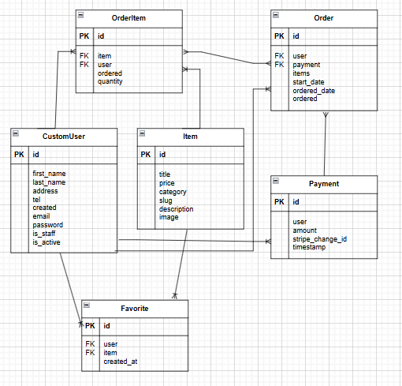

# ECサイトポートフォリオ

Django + BootstrapによるシンプルなECサイトです。ユーザー登録・商品閲覧・お気に入り機能・商品詳細モーダルなど、基本的な機能を備えています。

サイトURL：https://portfolio-ec-site.onrender.com/

---

## 📝 開発の背景

以前より機械学習(AI開発)分野に興味を持っており、そういった分野の開発にはどういった言語が適しているのだろうか？
と疑問に思い調べる中で、AIプログラミングには下記条件を満たしているPythonが適していることを知りました。
- 開発のしやすさ
- 十分な計算速度
- 安全性
- サービスにあった場所で動く事

そして、私自身扱えるバックエンド言語はPHPしかなかったため、機械学習分野に携わる可能性を考えたことや、自身のスキルを広げるためにも、
Pythonを扱えるようになろうと決意しました。

また、私自身コロナ禍において、直接お店まで買い物に行くことに対して抵抗を感じていた時期があり、Amazonや楽天などのECサイトを利用する場面が増えましたが、その経験からECサイトは生活を快適にしてくれるものという印象を持つことができ、私も誰かの生活を快適・豊かにできるようなものを作ってみたいという思いから、Python + ECサイトでポートフォリオを作成することに決めました。

---

## 🎯 開発の目的

- Pythonを用いたWebサイトの開発経験を積む。
- Pythonのフレームワークの扱いに慣れておく。(Djangoを利用)
- スクラッチ開発によって、Djangoの基本的な構成、動作を知る。
- Python3エンジニア認定実践試験の資格を得た上で実践的なサイトを作成することで、実務ができるスキルが備わっているということを企業にアピールする。

---

## 🔧 使用技術・スペック

- 言語：Python 3.13.3
- フレームワーク：Django 5.2.1
- フロントエンド：HTML5 / CSS3 / Bootstrap 5.3.3 / JavaScript / jQuery
- デプロイ：Render
- 認証：django-allauth
- バージョン管理：GitHub

---

## 🖥 主な機能

| 機能              | 説明 |
|-------------------|------|
| ユーザー登録・ログイン・ログアウト | django-allauthを使った認証機能 |
| ユーザー情報表示 | 登録したユーザー情報の表示と編集 |
| 商品検索  | 商品名、カテゴリー、価格、お気に入りで表示商品をフィルター |
| 商品一覧表示      | モデルに登録した商品を一覧表示 |
| 商品詳細モーダル   | JavaScriptで商品情報をモーダル表示 |
| 商品画像の拡大   | 商品購入画面にて、商品の画像をクリックした際、Bootstrap5のJavaScriptで商品画像を拡大表示 |
| お気に入り機能     | AJAX + jQuery による非同期切り替え |
| ショッピングカート機能     | 商品の削除、購入個数の変更機能 |
| レスポンシブ対応   | Bootstrapによるスマホ対応 |

---

## 🚀 開発手順
1.要件定義

ECサイトに主に必要となる機能を考え、実装する。
- 商品を購入するユーザーの作成
- ユーザーのログイン、ログアウト
- 商品検索
- 商品の一覧と詳細表示
- ショッピングカート
- 商品のお気に入り追加
- 決済処理　※本物のカード情報を入力される可能性を考慮し、今回は未実装。
- 購入確定時の確認メール送信　※Gmailを利用したメール送信の実装を試みたが、どうしてもセキュリティで弾かれてしまうため、Djangoのコンソールメールバックエンドを用い、メールの内容を確認するに留めた。よって未実装。


2.環境選定
- 機械学習に興味があった点から、将来的な開発も見据えてPythonの資格を取得。資格取得で得た知識を活かしたいと考え、開発言語はPythonを選択。
- 開発に使用したプライベートPCがWindowsであったため、ローカル環境はWindows上に構築。
- 無料でWeb公開できるサービスを調査した結果、Renderは無料でのデプロイが可能で、操作も比較的シンプルだったため、本番環境として選定。


3.データベース設計

このアプリでは、ユーザー管理・商品管理・注文処理・お気に入り機能など、ECサイトに必要な情報を扱うため、以下のようなデータベース設計を行った(本番環境ではPostgreSQLを使用)。

🔑 ユーザーモデル(CustomUser)
- Django標準のユーザーモデルを拡張し、メールアドレスをログインIDとして使用。
- 姓名・住所・電話番号といった基本的な個人情報を保持。
- 標準のUserManagerをカスタマイズし、スーパーユーザー作成時のバリデーションを実装。

📦 商品モデル(Item)
- 商品名・価格・カテゴリ・説明・画像情報などを保持。
- URL設計のためにslugフィールドを設定。

🛒 注文・カート管理
- OrderItem：商品と数量の1セット。ユーザーと商品に紐づく。この中間モデルにより、「同じ商品を複数追加」のような実際のカート動作を表現。
- Order：複数のOrderItemを持ち、ユーザー・注文日時・支払い情報と関連。このモデルはPaymentと疎結合(SET_NULL)させており、支払い未完でもデータ保持を可能にしている。
- Payment：支払い情報を記録。※Stripe(決済処理)との連携を想定していたが、本物のカード情報を入力される可能性を考慮し、Stripeは未実装。

❤️ お気に入り機能(Favorite)
- ユーザーと商品を中間テーブルで結び、お気に入りを管理。
- 同一商品の重複登録を防止するため、unique_togetherを指定。


4.ER図作成

本ECサイトのエンティティ・リレーション構造は以下の通り。



---

## 💪 開発で工夫した点（アピールポイント）

- **JavaScriptとjQueryを併用**し、モーダル表示や非同期更新をスムーズに実装。
```javascript
// お気に入り切り替え(非同期更新)
$(".favorite-button").on("click", function () {
    const $button = $(this);
    const slug = $button.data("slug");
    const isFavorited = $button.data("favorited") === true;
    // AJAXを用い、お気に入り切り替えを非同期で処理
    $.ajax({
        url: `/toggle-favorite/${slug}/`,
        type: "POST",
        headers: {
            "X-CSRFToken": getCookie("csrftoken")
        },
        contentType: "application/json",
        data: JSON.stringify({ favorited: !isFavorited }),
        success: function (response) {
            if (response.is_favorited) {
                $button.html("❤️ お気に入り済み")
                        .removeClass("btn-outline-danger")
                        .addClass("btn-danger")
                        .data("favorited", true);
            } else {
                $button.html("🤍 お気に入り")
                        .removeClass("btn-danger")
                        .addClass("btn-outline-danger")
                        .data("favorited", false);
            }
        },
        error: function () {
            console.error("お気に入りの切り替えに失敗しました");
        }
    });
});
```
- **バリデーションの強化、およびエラー時のユーザー体験向上**：パスワードに対して正規表現を使い、セキュリティを意識。また、入力エラーに対して説明を表示することで、ユーザーが即座に問題を確認できるように対応。
```python
class SignupUserForm(SignupForm):
    # オリジナルフォームのフィールド定義
    first_name = forms.CharField(max_length=30, label="性")
    last_name = forms.CharField(max_length=30, label="名")

    # メールアドレスの重複チェック
    def clean_email(self):
        email = self.cleaned_data['email']
        if CustomUser.objects.filter(email=email).exists():
            raise forms.ValidationError("既に登録されているメールアドレスです。")
        return email
    
    # パスワードの入力制限
    def clean_password1(self):
        password = self.cleaned_data.get("password1")
        if not re.match(r"^[a-zA-Z0-9]+$", password):
            raise forms.ValidationError("パスワードは半角英数字のみで入力してください。")
        return password

    # 登録処理
    def save(self, request):
        user = super(SignupUserForm, self).save(request)
        user.first_name = self.cleaned_data["first_name"]
        user.last_name = self.cleaned_data["last_name"]
        user.save()
        return user
```
- **レスポンシブ対応**：Bootstrapを用い、スマホ画面でも整ったスタイルを実現。
```html
<!-- デバイス幅に応じて、商品カードの列数を調整 -->
<div class="row" id="product-container">
    
        <div class="col-lg-3 col-md-6">
            <div class="card img-thumbnail itemlist mb-3 position-relative">
                <div class="category-label">{{ item.category }}</div>
                <a href="" class="stretched-link">
                    
                </a>
                <div class="card-body text-center px-2 py-3">
                    <h5 class="font-weight-bold">{{ item.title }}</h5>
                    <h4 class="font-weight-bold">{{ item.price|custom_price }}円</h4>
                    <!-- 商品詳細ボタン -->
                    <div class="text-center mt-2">
                        <button type="button" class="btn btn-primary btn-sm product-detail-button"
                                data-bs-toggle="modal"
                                data-bs-target="#productModal"
                                data-title="{{ item.title }}"
                                data-category="{{ item.category }}"
                                data-price="{{ item.price|custom_price }}"
                                data-description="{{ item.description }}"
                                data-image="{{ item.image.url }}">
                            商品詳細
                        </button>
                    </div>
                    <!-- お気に入りボタン -->
                    
                        <button class="btn btn-outline-danger btn-sm favorite-button"
                                data-slug="{{ item.slug }}"
                                data-favorited="{{ item.is_favorited|yesno:'true,false' }}">
                            
                                ❤️ お気に入り済み
                            
                                🤍 お気に入り
                            
                        </button>
                    
                </div>
            </div>
        </div>
    
</div>

<!-- img-fluid クラスによる画像の可変対応 -->
<div class="d-flex align-items-center justify-content-center">
    <a href="" class="flex-shrink-0">
        
    </a>
    <div class="ms-3">
        <h5 class="mb-2">{{ item.title }}</h5>
        <p class="text-danger fw-bold">{{ item.price|custom_price }}円</p>
    </div>
</div>
```
---